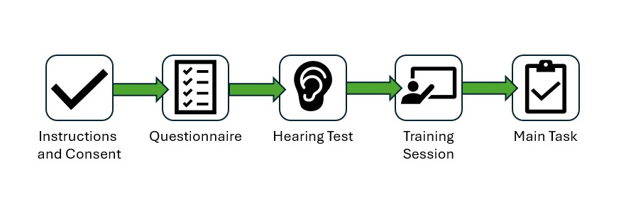

# Survey generation and results analysis

This repository contains scripts to generate Speech Intelligibility Tests (SIT) and MUSHRA surveys through Qualtrics and to analyze the results. The SIT scripts are developed to accompany the release of multilingual Diagnostic Rhyme Test (DRT) [audio data](speech-intelligibility-DRT).

The project has two main components: [survey_generation](survey_generation) and [results_analysis](results_analysis).


## Generate a survey
A Qualtrics qsf file is generated by running this script, with a json file as input:

### Environment 

```
python3 -m venv env
source env/bin/activate
pip install -r requirements.txt
```

### Execution
To create a SIT/DRT survey:
```
(env) python3 create_sit_test.py -ji examples/survey_recipe_release.json 
```
To create a MUSHRA test:
```
(env) python3 create_mushra_test.py -ji examples/mushra_recipe_release.json 
```

This qsf file can then be uploaded to Qualtrics to run the SIT test.

These files are contained in the `survey_generation` directory. For details, refer to the corresponding [documentation](survey_generation/README.md).


## Analyze survey results
The `results_analysis` [directory](results_analysis) is under construction. It will contain tools to analyze test results collected through Qualtrics.


## Structure of the Listening Tests
Both listeninig test implementations (Diagnostic Rhyme Test for speech intelligibility and MUSHRA for speech quality) follow the same general structure:


The key difference between the two survey types in terms of the survey flow is that the MUSHRA design allows the user to take up to three blocks of the Main Task. For a more detailed outline of the survey components and specifications, please refer to the project [wiki](wiki/Qualtrics-SIT-Survey).


## Requirements

### Data
This SIT survey is based on multilingual DRT datasets. The present scripts assume specfic data formatting requirements. For these dataset specifications, please refer to `survey_generation` [documentation](survey-setup-tools/survey_generation/MUSHRA/README.md).
MUSHRA surveys can be run with any clean speech data. 

### Qualtrics
The use of this Qualtrics qsf file requires a Qualtrics paid account, as crucial features used in the test are not supported by free accounts.


## CONTRIBUTION

[CONTRIBUTING.md](CONTRIBUTING.md)

## LICENSE

[LICENSE](LICENSE)
